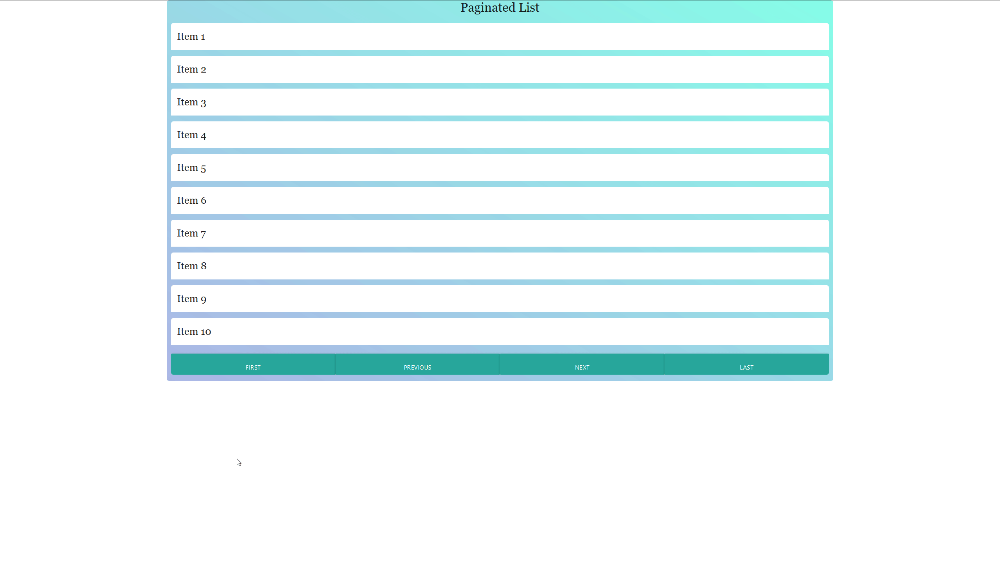

# Pagify JS

## Include in your project

```
<script src="paginator.js"></script>
```

## Result of Pagify

* A Root HTML DOM element will be created, as defined by the 'html_for_list' object
* Child DOM elements will be placed inside of that list, each with custom HTML as defined by you
* First, Previous, Next, and Last event listeners to navigate through the objects
* Max items per page definable




## Quick Start
```
let options = {
  json: data,
  fields_to_include_from_json: fields_to_include_from_json,
  parent_dom: parent_dom,
  html_for_item_dom: html_for_item_dom,
  max_events_per_page: 10,
  buttons: {
    first: 'first',
    previous: 'previous',
    next: 'next',
    last: 'last'
  }
}
let pg = new Paginator(options);

```

Simply use the built in add_event_listeners_to_buttons method to attach the first, previous, next, and last buttons to the paginated data
```
pg.add_event_listeners_to_buttons();
```
Finally, draw the items on the page:
```
pg.draw_items();
```
## Define Your JSON Data Source

It can be from whatever source you prefer, but it must be converted to a JSON object before it is passed into Pagify.

```
let data = [{
  name: 'Patrick',
  job: 'Snorkeling'
},
{
  name: 'Stephen',
  job: 'Banker'
},
{
  name: 'Bob',
  job: 'Developer'
}];
```

## Define HTML for parent DOM and child dom elements

This will determine how each field from the data source above appears in your paginated list.


#### parent_dom
:warning: *: make sure the name of your parent dom element contains "pg_1" - this determines the starting page number of your paginator*

Root / parent DOM element that contains your list of paginated items.

```
<ul id="event_list" name="pg_1">
</ul>
```

Safe to say this will usually be a ul

```
let parent_dom = document.getElementById('event_list');
```

#### html_for_item_dom

The html that will wrap around each item in your data set.

Safe to say this will usually be an li
```
let html_for_item_dom = {
  html_list_start_tag: '<li class="py-2">',
  html_list_close_tag: '</li>'
}
```


#### fields_to_include_from_json
Describes which fields you would like to include from your data source, and their associated html / styling.
```
let fields_to_include_from_json = [{
  name: 'title',
  html: '<div class="collapsible-header rounded-t-md center-align h2 georgia">',
  html_close_tag: '</div>'

},
{
  name: 'description',
  html: '<div class="collapsible-body rounded-b-lg georgia white"><span class="f1">',
  html_close_tag: '</span></div>'
}];

```
## Create Your Buttons

By default, Paginator will automatically find your buttons as long as their id's match what is listed below.

```
<button id="first">First</button>
<button id="previous">Previous</button>
<button id="next">Next</button>
<button id="last">Last</button>
```

You can also choose to pass your button ids in as an object.

```
let buttons = {
  first: 'FirstButtonId',
  previous: 'PreviousButtonId',
  next: 'NextButtonId',
  last: 'LastButtonId'
}
```
